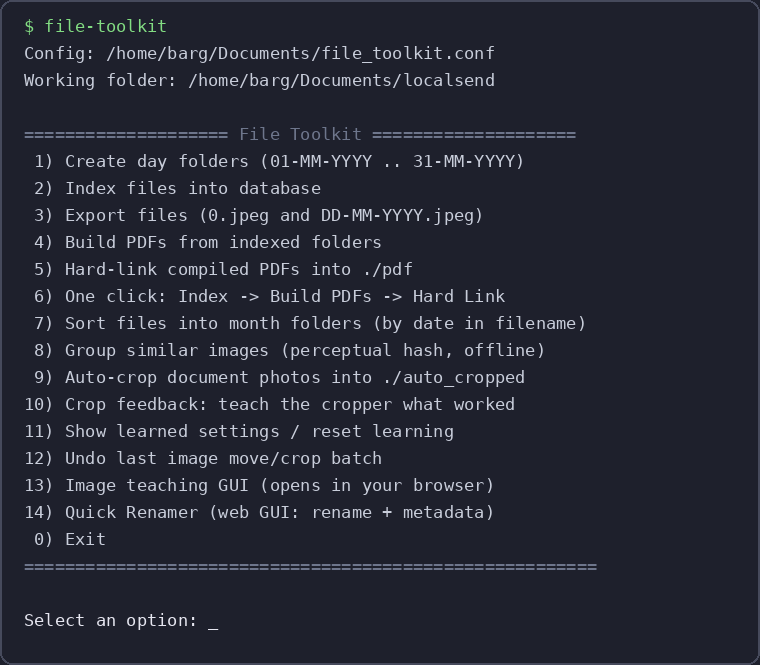
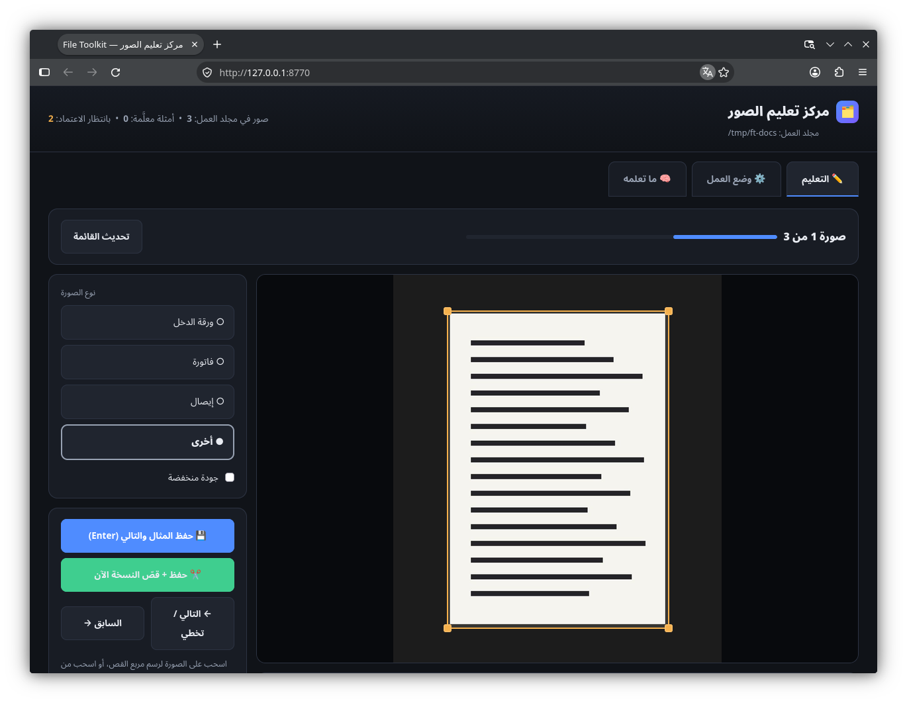
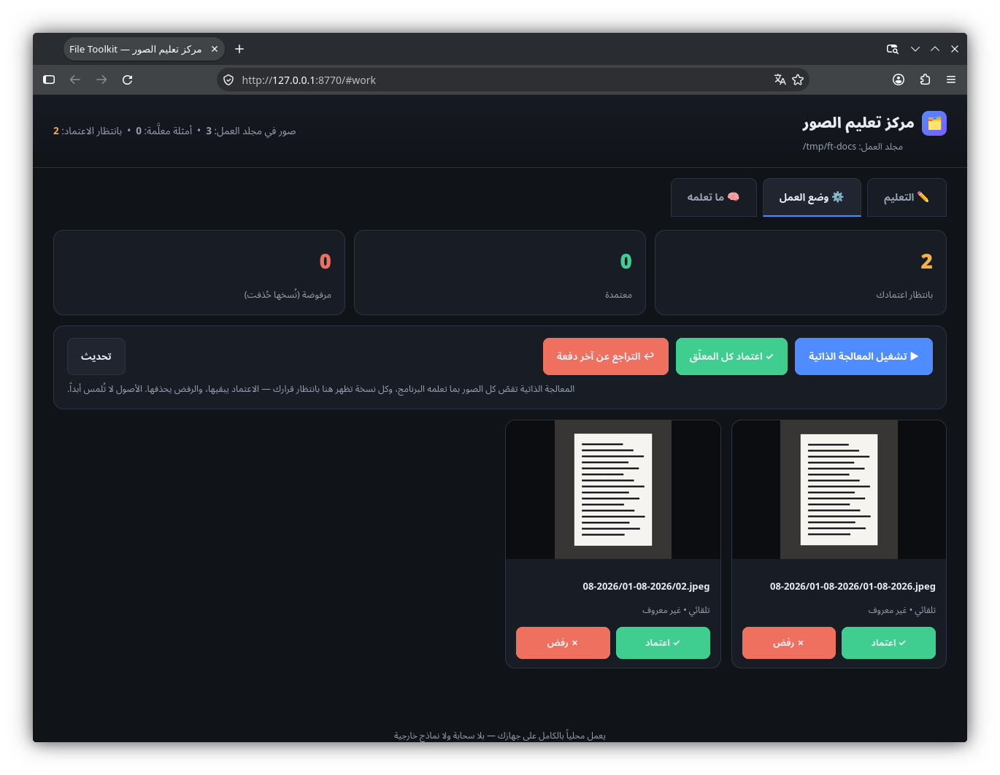
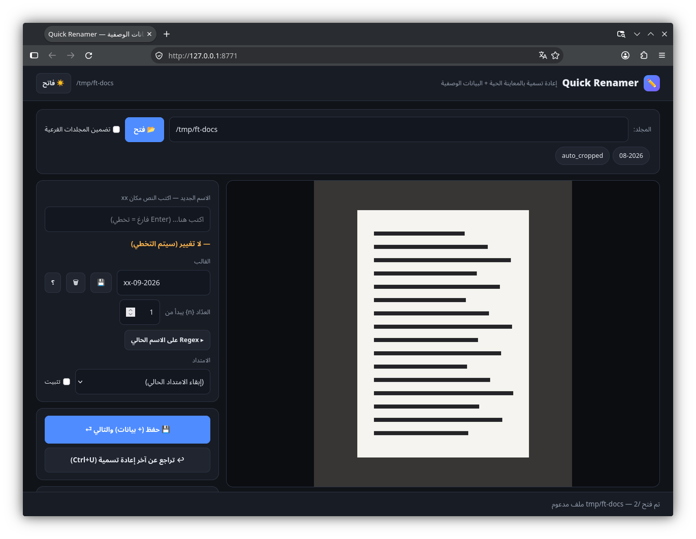

# 🗂️ File Toolkit

أداة واحدة لتنظيم صورك ومستنداتك: فرز الصور المتشابهة، قصّ المستندات تلقائياً،
تعليم البرنامج كيف يقصّ، إعادة تسمية بالمعاينة الحية، وتجميع المجلدات في PDF —
**كل شيء يعمل محلياً على جهازك، مجاناً وبلا سحابة أو نماذج خارجية.**



## التثبيت (بـ uv)

```bash
git clone https://github.com/WissamZa/file-toolkit.git
cd file-toolkit
uv sync
uv run file_toolkit.py
```

أو ثبّته لتعمل من أي مكان: `./install.sh` ثم اكتب `file-toolkit` في أي مجلد.

---

## الاستخدام المبسّط

### 1️⃣ تنظيم المجلدات والـPDF (الخيارات 1–7)

أنشئ مجلدات يومية لشهر معين، افتر الملفات حسب التاريخ المكتوب في أسمائها
(`01-08-2026.jpg` ← مجلد `08-2026`)، وجمّع كل مجلد في PDF واحد — كلها من القائمة
بالترتيب الذي يناسبك.

### 2️⃣ فرز الصور المتشابهة (الخيار 8)

يعرض البرنامج خطة كاملة: كل مجموعة صور متشابهة وأين ستُنقل — **ولا ينقل شيئاً
حتى تختار أنت** أرقام المجموعات (مثلاً `1,3-5` أو `a` للكل أو Enter للإلغاء).
الصور المختارة تذهب إلى `similar_review/` للمراجعة اليدوية.

### 3️⃣ القصّ التلقائي للمستندات (الخيار 9)

يقصّ خلفية الصور ويحفظ نسخة نظيفة في `auto_cropped/` — **الأصل لا يُمس أبداً**.
الصور المقصوصة أصلاً تُتخطى تلقائياً.

### 4️⃣ علّم البرنامج ثم اعتمد أعماله (الخيار 13)

افتح واجهة التعليم في المتصفح:



- اسحب مربع القص الصحيح على الصورة، واختر نوعها (ورقة الدخل / فاتورة / إيصال).
- من تبويب **وضع العمل** شغّل المعالجة الذاتية: يقصّ البرنامج كل الصور بما تعلمه
  ويعرض النتائج **بانتظار اعتمادك** — تعتمد فتبقى، أو ترفض فتُحذف:



كل صورة قادمة بنفس أبعاد صورة علّمتها تُقصّ تلقائياً بنفس الطريقة.

### 5️⃣ إعادة التسمية بالمعاينة الحية (الخيار 14)



قوالب جاهزة (`{orig}`, `{n:03}`, `{date}`, `{mtime}` أو اكتب مكان `xx`)، بحث
واستبدال بالـRegex، تغيير الامتداد، وتعديل البيانات الوصفية لـPDF/EXIF/PNG —
معالقة تعارضات وتراجع بضغطة. وكل ذلك متاح أيضاً **جماعياً**: تطبيق القالب على
كل ملفات المجلد دفعة واحدة مع جدول معاينة (القديم ← الجديد) قبل التنفيذ وتراجع
جماعي بضغطة.

### 6️⃣ التراجع عن أي شيء (الخيار 12)

كل نقل وقصّ وإعادة تسمية يُسجَّل في قاعدة البيانات — الخيار 12 يلغي آخر دفعة
كاملة ويعيد كل ملف لمكانه الأصلي.

---

## كيف يتعلم البرنامج؟

كل إجابة تعطيها (مجموعة ليست متشابهة، قصّ ضيق جداً، اعتماد…) تُسجَّل وتعدّل
المعاملات تلقائياً ضمن حدود آمنة. الخيار 11 يعرض ما تعلمه البرنامج ويعيد ضبطه.

## الإعدادات (اختيارية)

ملف `file_toolkit.conf` يحدد مجلد العمل ومواضع المخرجات:

```ini
[settings]
folder = /home/barg/Documents/localsend   ; مجلد العمل
database = files.db
similar_review = similar_review           ; مجلد مراجعة المتشابهات
cropped_output = auto_cropped             ; النسخ المقصوصة
```

## المتطلبات

Python 3.9+ فقط — والباقي يتولاه `uv sync` (reportlab, pypdf, Pillow,
imagehash, numpy, PyMuPDF, piexif). الواجهات الرسومية تعمل في المتصفح بلا
أي متطلبات إضافية.

## الترخيص

MIT
